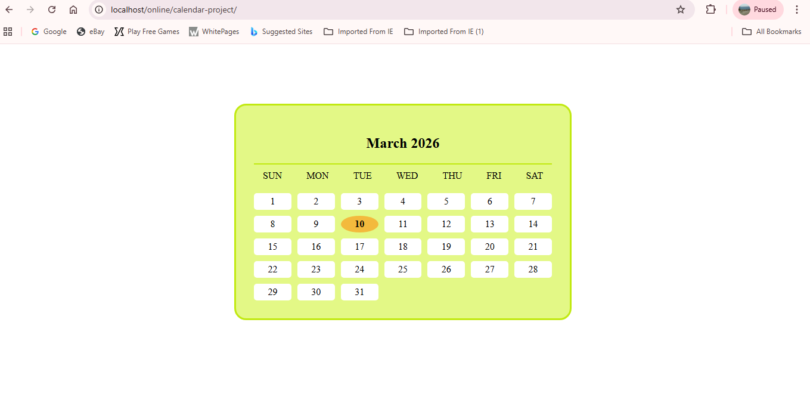

# 📅 Dynamic Calendar

A simple **Dynamic Calendar Web Application** built using **HTML, CSS, and JavaScript**.
The calendar automatically displays the **current month and year**, generates all dates dynamically, and highlights **today's date**.

---

## 📸 Project Screenshot



---

## 📌 Features

* Displays the **current month and year**
* Automatically **generates all dates**
* Highlights **today’s date**
* Clean **calendar UI**
* Built using **JavaScript Date object**

---

## 🛠️ Technologies Used

* HTML
* CSS
* JavaScript
* DOM Manipulation

---

## 📂 Project Structure

```
calendar-project
│
├── index.html
├── README.md
└── images
    └── calendar.png
```

---

## ⚙️ How to Run the Project

1. Clone the repository

```
git clone https://github.com/shifaparveen-webdev/calendar-project.git
```

2. Open the project folder.

3. Open **index.html** in your browser.

The calendar will automatically display the **current month and today's date**.

---

## 🎯 Learning Outcomes

Through this project I learned:

* JavaScript **Date object**
* Dynamic **DOM element creation**
* CSS **Grid layout**
* Highlighting today's date using JavaScript

---

## 🚀 Future Improvements

* Add **Next / Previous month navigation**
* Add **event reminders**
* Add **holiday highlighting**
* Make it **fully responsive**

---

## 👩‍💻 Author

**Shifa Parveen**

GitHub:
[https://github.com/shifaparveen-webdev](https://github.com/shifaparveen-webdev)
